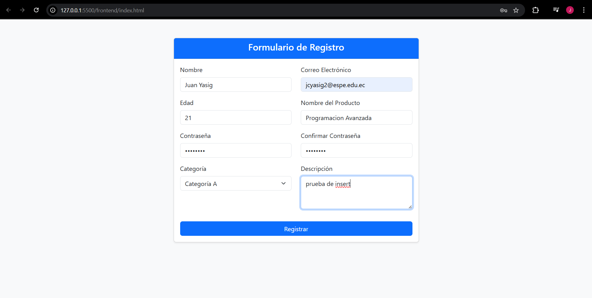
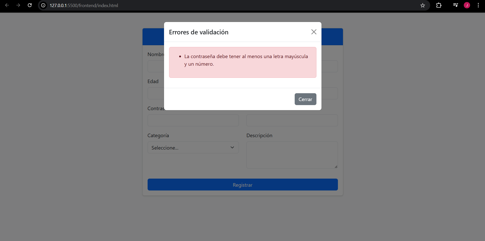
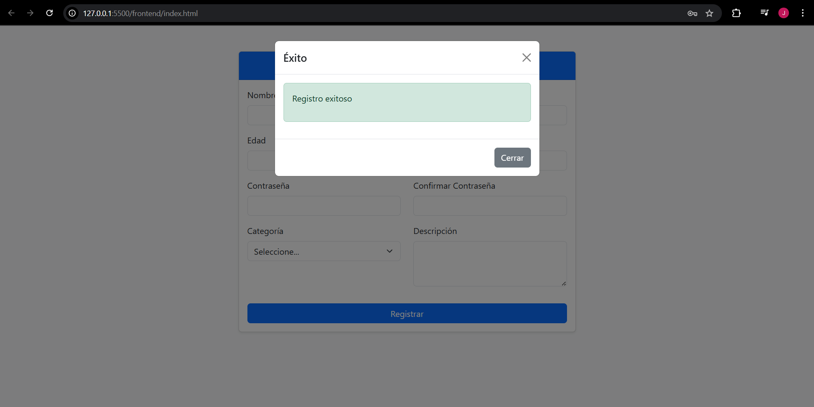
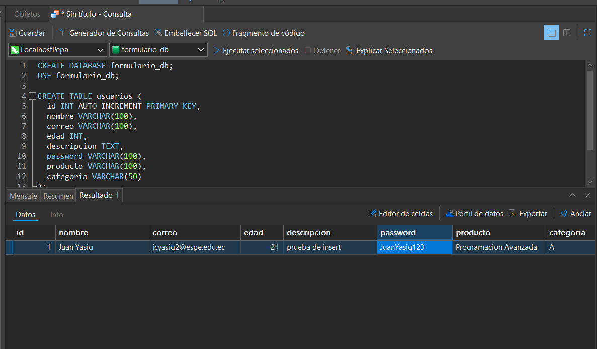

# 🧾 Tarea 3 – Programación Avanzada  
**Nombre:** Yasig Juan  
**Materia:** Programación Avanzada  
**Unidad 2: Desarrollo Full Stack con Validaciones y Persistencia de Datos**  
**Repositorio GitHub:** [U2Tarea3_YasigJuan_Avanzada](https://github.com/juanelocy/U2Tarea3_YasigJuan_Avanzada)

---

## 📌 Descripción del Proyecto

Este proyecto consiste en la creación de un formulario web completo con validaciones del lado del cliente y del servidor, utilizando tecnologías full stack como HTML, CSS, JavaScript, Node.js, Express y MySQL.

Se simula un formulario de registro para productos y usuarios, validando los datos tanto en el navegador como en el backend, y finalmente almacenándolos en una base de datos relacional.

---

## 🧪 Tecnologías y Dependencias

### 🔹 Frontend

- `HTML5`
- `CSS3`
- `JavaScript` (puro)
- `Bootstrap 5` (via CDN)

### 🔹 Backend

- `Node.js`
- `Express.js` – Framework para el servidor
- `mysql2` – Cliente para conexión con MySQL
- `body-parser` – Para parsear datos del formulario (JSON y urlencoded)
- `cors` – Permite comunicación entre el frontend y backend en localhost

### 🔹 Dependencias instaladas en el backend

Estas son todas las dependencias instaladas en la carpeta `backend/`:

```bash
npm install express mysql2 body-parser cors
```

---

## 📁 Estructura del Proyecto

```
U2Tarea3_YasigJuan_Avanzada/
│
├── backend/
│   ├── db.js                # Conexión a la base de datos MySQL
│   ├── server.js            # Lógica del servidor y validaciones backend
│   └── package.json         # Dependencias de Node.js
│
├── frontend/
│   ├── index.html           # Formulario web con Bootstrap 5
│   ├── script.js            # Validaciones cliente + envío con fetch
│   ├── styles.css           # Estilos adicionales opcionales
|
├── imagenes/                # Pruebas de ejecucion y validaciones
│
├── .gitignore               # Evita subir node_modules, logs y archivos sensibles
└── README.md                # Documentación del proyecto
```

---

## ✅ Requisitos Cumplidos

### 🔹 Parte 1: Preparación del Entorno y Formulario Base
- Se creó un proyecto con frontend (HTML, CSS, JS) y backend (Node.js + Express).
- Conexión configurada con base de datos MySQL.
- El formulario incluye al menos 7 campos:
    - Nombre
    - Correo electrónico
    - Edad
    - Descripción
    - Contraseña
    - Confirmación de contraseña
    - Producto y categoría

### 🔹 Parte 2: Validación del Lado del Cliente (Frontend)
- Validación con HTML5 (`required`, `min`, `type`, `maxlength`, etc).
- Validación adicional con JavaScript:
    - Todos los campos requeridos llenos.
    - Email con formato válido.
    - Contraseña segura (mayúscula y número).
    - Confirmación de contraseña.
    - Rango de edad entre 18 y 99.
    - Máximo 200 caracteres en la descripción.
- Los errores se muestran con modal Bootstrap personalizada.

### 🔹 Parte 3: Validación del Lado del Servidor y Persistencia
- Ruta POST `/registro` que recibe y valida datos.
- Todas las validaciones se replican y refuerzan en el backend.
- Los datos se almacenan en una tabla MySQL (`usuarios`) si todo es válido.
- Errores se devuelven como JSON o se muestran en la interfaz.
- Modal Bootstrap muestra confirmación o errores al usuario.

---

## 🗃️ Base de Datos

Ejecutar lo siguiente en tu servidor MySQL:

```sql
CREATE DATABASE formulario_db;
USE formulario_db;

CREATE TABLE usuarios (
    id INT AUTO_INCREMENT PRIMARY KEY,
    nombre VARCHAR(100),
    correo VARCHAR(100),
    edad INT,
    descripcion TEXT,
    password VARCHAR(100),
    producto VARCHAR(100),
    categoria VARCHAR(50)
);
```

---

## ⚙️ Instrucciones para Ejecutar

### 🔧 Requisitos
- Node.js y npm instalados
- MySQL funcionando localmente
- Editor de código (ej: VSCode)

### 🚀 Pasos

1. **Clonar el repositorio:**
     ```bash
     git clone https://github.com/juanelocy/U2Tarea3_YasigJuan_Avanzada.git
     cd U2Tarea3_YasigJuan_Avanzada
     ```

2. **Configurar la base de datos:**
     - Crea la base de datos y la tabla ejecutando el script SQL mostrado arriba.
     - Edita credenciales en `backend/db.js`:
         ```js
         const connection = mysql.createConnection({
             host: 'localhost',
             user: 'TU_USUARIO',
             password: 'TU_CONTRASEÑA',
             database: 'formulario_db'
         });
         ```

3. **Instalar las dependencias del backend:**
     ```bash
     cd backend
     npm install
     ```

4. **Iniciar el servidor:**
     ```bash
     node server.js
     ```

5. **Abrir el formulario en el navegador:**
     - Abre directamente el archivo `frontend/index.html` con tu navegador.

---

## 📸 Vista previa

- Formulario responsive en dos columnas.


- Mensajes de error y éxito mostrados en una modal.



- Verificacion de los datos en Base de datos Mysql.


---

## ℹ️ Notas adicionales

- El proyecto no incluye autenticación avanzada ni cifrado de contraseñas (recomendado para producción).
- El frontend y backend están desacoplados; asegúrate de que el backend esté corriendo antes de enviar datos.
- Si usas puertos personalizados, revisa la configuración en `server.js` y en las llamadas `fetch` del frontend.
